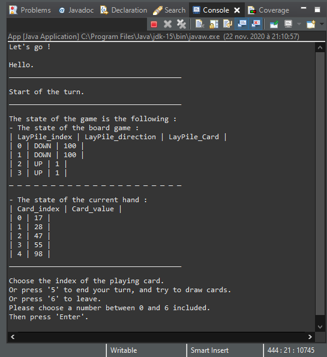
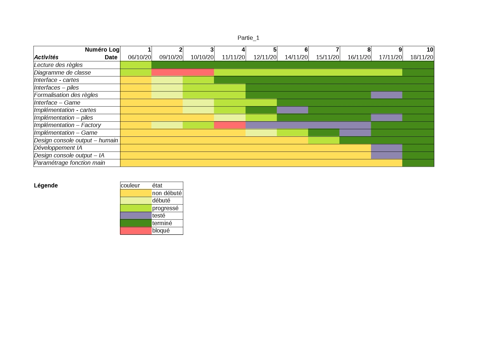
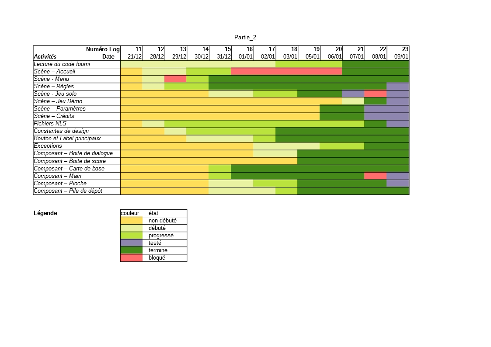

# ACDC-TheGame

Un arbitre, une IA et une IHM pour *The game*.

IMT - FIL1 - 2020

*JALLAIS Adrien : adrien.jallais@protonmail.com*

__*Partie 1 & 2 - Version 1.2*__

## Introduction

Dans le cadre du cours Actualisation des Compétences en Développement et Conception (ACDC), Rémi Douence a proposé de développer une application basée sur le jeu *The Game*.

### Règles

Les règles du jeu sont disponibles aux fichiers  suivant : 

+ version anglaise : [the-game-english](./Consignes/the-game-english.pdf),
+ version française : [the-game-francais](./Consignes/the-game-francais.pdf).

#### Dimension linguistique

Dans le but de maintenir un langage de développement homogène avec celui des règles fournies, et de faciliter un transfert du code entre système Unix et Windows, nous avons favorisé l'usage de la langue anglaise.

Une traduction des éléments du jeu est fournie ci-dessous afin de faciliter l'utilisation et la lecture du code de l'application :

+ *Pile*
  + *LayPile* = pile de dépôt
    + *Descending pile* = pile de dépôt descendante
    + *Ascending pile* = pile de dépôt ascendante  
  + *DrawPile* = pioche
  + *Hand* = cartes en main
+ *Backwards* (BW) *trick* = action de poser une carte sur une *LayPile*, dont la valeur est +/-=10 à la valeur de la dernière carte posée.
+ *Rules* = règles du jeu

### Utilisation de l'application

Les fichiers sources sont accessibles dans le dossier suivant : [Code](./Code), contenant : 

+ partie 1 :
	+ backend : [Code/FIL A1 ACDC Partie1 Jallais Adrien](./Code/FIL%20A1%20ACDC%20Partie1%20Jallais%20Adrien/src),
+ partie 2 :
	+ backend : [Code/FIL A1 ACDC Partie1 Kirchhoffer Nicolas](./Code/FIL%20A1%20ACDC%20Partie2%20Kirchhoffer%20Nicolas/src).
	+ frontend : [Code/FIL A1 ACDC Partie2 Jallais Adrien](./Code/FIL%20A1%20ACDC%20Partie2%20Jallais%20Adrien/src).

Pour savoir comment lancer les différentes applications correspondantes aux différentes parties, reportez-vous aux fichiers suivants : 

+ partie 1 (en mode console) : [module-info.java](./Code/FIL%20A1%20ACDC%20Partie1%20Jallais%20Adrien/src/module-info.java),
+ partie 2 (avec une IHM utilisant JavaFX) : [module-info.java](./Code/FIL%20A1%20ACDC%20Partie2%20Jallais%20Adrien/src/module-info.java).

### Objectifs

Comme le décrivent les consignes disponibles dans le document suivant : [presentation-projet-eleves-2020-2021.pdf](./Consignes/presentation-projet-eleves-2020-2021.pdf), les objectifs pédagogiques de son projet sont les suivants :

+ Suivre l'évolution de la conception d'un projet logiciel,
+ Favoriser la programmation orientée objet,
+ Appréhender l'utilisation de code réalisé par les ressources métiers pour la réalisation d'une interface graphique.

### Deux parties pour deux auteurs

La première partie (*backend*) a été réalisée par Adrien JALLAIS.
La seconde partie (*frontend*) a été réalisée par Adrien JALLAIS, mais celle-ci se base sur une première partie réalisée par Nicolas KIRCHHOFFER.

## Résultats

### Aperçu 

#### Partie 1 (backend)

L'*Illustration 1-1* présente ce qu'affiche la console lors du lancement d'une partie.

*__Illustration 1-1 :__ Capture de la console au lancement d'une partie.*

#### Partie 2 (frontend)

L'*Illustration 1-2-1* présente ce que la fenêtre cliente affiche au cours d'une partie en **mode Solo**.

*__Illustration 1-2-1 :__ Capture de la fenêtre au cours d'une partie en mode Solo.*

L'*Illustration 1-2-2* présente ce que la fenêtre cliente affiche au départ d'une partie en **mode Démonstration**.

*__Illustration 1-2-2 :__ Capture de la fenêtre au départ d'une partie en mode Démonstration.*

### Progression et suivi du projet

Un fichier décrivant les logs réalisés quotidiennement est disponible dans le fichier suivant : [log.Jallais.Adrien.json](./log.Jallais.Adrien.json). En complément, le *Tableau 1* et le *Tableau 2* illustrent ces logs pour mieux visualiser la cinétique de développement du projet au cours de la première (*backend*) et de la seconde partie (*frontend*) respectivement..

*__Tableau 1 :__ Grille de progression du développement de l'application (partie api). Les logs représentent un jour de travail.*

*__Tableau 2 :__ Grille de progression du développement de l'application (partie IHM). Les logs représentent un jour de travail.*

### Diagrammes de classe

Des diagrammes de classe UML ont été générés avec [ObjectAid UML Explorer](https://objectaid.com/home). Les relations entre ses entités étant ajoutées de manière automatique, il est rapidement devenu surchargé et illisible.

Afin d'améliorer leur lisibilité, les caractéristiques suivantes ne sont pas montrées :

+ les relations de dépendance entre les classes (au profit de celles entre les packages),
+ les méthodes de visibilité publique des classes implémentant des interfaces (afin d'éviter une répétition entre ces deux entités).

#### Partie 1 (backend)

*__Illustration 2 :__  Diagramme UML de classe de l'application pour la partie 1 (backend).*

#### Partie 2 (frontend)

*__Illustration 2 :__  Diagramme UML de classe de l'application pour la partie 2 (frontend).*