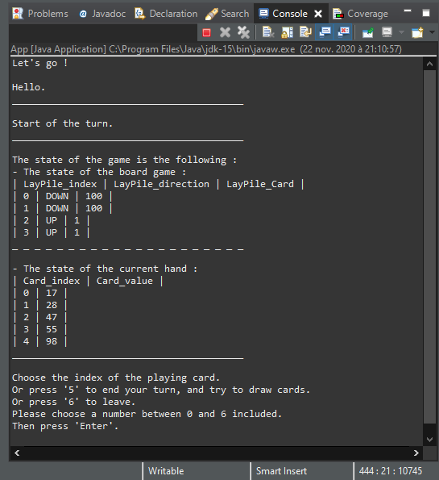

# ACDC-TheGame

Un arbitre, une IA et une IHM pour *The game*.

IMT - FIL1 - 2020

*JALLAIS Adrien : adrien.jallais@protonmail.com*

__*Partie 1 - Version 1.1*__

## Introduction

Dans le cadre du cours Actualisation des Compétences en Développement et Conception (ACDC), Rémi Douence a proposé de développer une application basée sur le jeu *The Game*.

### Objectifs

Comme le décrivent les consignes disponibles dans le document suivant : [presentation-projet-eleves-2020-2021.pdf](./Consignes/presentation-projet-eleves-2020-2021.pdf), les objectifs pédagogiques de son projet sont les suivants :

+ Suivre l'évolution de la conception d'un projet logiciel ;
+ Favoriser la programmation orientée objet ;
+ Appréhender l'utilisation de code réalisé par les ressources métiers pour la réalisation d'une interface graphique.

### Utilisation de l'application

Les fichiers sources sont accessibles dans le dossier suivant : [Code/FIL A1 ACDC Partie1 Jallais Adrien](./Code/FIL%20A1%20ACDC%20Partie1%20Jallais%20Adrien/src).
Pour savoir comment lancer l'application, reportez-vous au fichier suivant : [module-info.java](./Code/FIL%20A1%20ACDC%20Partie1%20Jallais%20Adrien/src/module-info.java).

### Règles

Les règles du jeu sont disponibles dans le fichier suivant : [the-game-english](./Consignes/the-game-english.pdf).

## Résultats

### Aperçu

L'*Illustration 1* présente ce qu'affiche la console lors du lancement d'une partie.



*__Illustration 1 :__ Capture de la console au lancement d'une partie.*

### Dimension linguistique

Dans le but de maintenir un langage de développement homogène avec celui des règles fournies, et de faciliter un transfert du code entre système Unix et Windows, nous avons favorisé l'usage de la langue anglaise.

Une traduction des éléments du jeu est fournie ci-dessous afin de faciliter l'utilisation et la lecture du code de l'application :

+ *Pile*
  + *LayPile* = pile de dépôt
    + *Descending pile* = pile de dépôt descendante
    + *Ascending pile* = pile de dépôt ascendante  
  + *DrawPile* = pioche
  + *Hand* = cartes en main
+ *Backwards* (BW) *trick* = action de poser une carte sur une *LayPile*, dont la valeur est +/-=10 à la valeur de la dernière carte posée.
+ *Rules* = règles du jeu

### Progression et suivi du projet

Un fichier décrivant les logs réalisés quotidiennement est disponible dans le fichier suivant : [log.Jallais.Adrien.json](../log.Jallais.Adrien.json). En complément, le *Tableau 1* illustre ces logs pour mieux visualiser la cinétique de développement du projet.


*__Tableau 1 :__ Grille de progression du développement de l'application. Les logs représentent un jour de travail.*

Avec le *Tableau 1*, on observe que l'écriture des interfaces a permis de guider le développement des classes concrètes les implémentant, et que le développement a commencé par les objets les plus basiques (Cartes, Piles) pour servir de base à des objets intermédiaires (Fabriques), ou plus complexes (Jeu puis Service de Résolution). 

### Diagramme de classe

L' *Illustration 2* est un diagramme de classe UML généré avec [ObjectAid UML Explorer](https://objectaid.com/home). Les relations entre ses entités étant ajoutées de manière automatique, il est rapidement devenu surchargé et illisible, comme le montre sa [version brute](./Code/FIL%20A1%20ACDC%20Partie1%20Jallais%20Adrien/src/FIL_A1_ACDC_Partie1_Jallais_Adrien-UML-Vraw.png). 
Afin d'améliorer sa lisibilité, les caractéristiques suivantes ne sont pas montrées :

+ les relations de dépendance entre les classes (au profit de celles entre les packages),
+ les méthodes de visibilité publique des classes implémentant des interfaces (afin d'éviter une répétition entre ces deux entités).


*__Illustration 2 :__  Diagramme UML de classe de l'application.*

L'*Illustration 2* présente la composition de notre application. Les packages ont été divisés dans le but de rassembler des fonctionnalités communes et/ou des classes au degré de complexité commun et/ou des objets strictement indépendants :

+ Ainsi, les classes suivant le patron de conception d'une Fabrique ont été regroupées dans le package *fabrique*. De plus, les méthodes statiques qui ont pour but de fournir un service sont regroupées dans le package *service*. Ces services ont comme objectif de présenter les fonctionnalités suivantes :
	+ l'interaction avec l'utilisateur (*ServiceUser*),  
	+ la formalisation des règles du jeu (*ServiceRules*),
	+ la résolution du jeu (*ServiceResolution*).
+ Ainsi, avec un degré de complexité croissant, on note les packages suivants : *card*, *pile* et *game*.
+ Ainsi, la classe d'énumération *Direction* et la classe *App* sont dans des packages indépendants : *direction* et *app* , respectivement.

Les classes concrètes (comme *GameFactory*, *Game*, *DrawPileFactory*, *DrawPile*, *Hand*) n'ont pas de relations d'association avec d'autres classes concrètes ; en effet, celles-ci sont associées à des interfaces, et ces dernières sont implémentées par les classes concrètes correspondantes.

Les Fabriques permettent de sécuriser la création de la pile de pioche (*DrawPile*) et du jeu (*Game*), avec *DrawPileFactory*. En effet, selon les règles données par *ServicesRules*, les fabriques vérifient notamment la validité de la pioche fournie (comme l'intervalle des cartes autorisées) et règlent la composition concrète d'un jeu (comme le nombre de *Descending* et *Ascending Pile*).

Les méthodes de *ServiceResolution* sont statistiques, et ne sont pas dans le même package que celui de la classe *Game* en vue de la mise en place d'une structure tendant à résoudre une partie selon le principe d'une API ([interface de programmation](https://fr.wikipedia.org/wiki/Interface_de_programmation)).

Les classes *LayInfo* et *Move* du package *game* permettent de présenter des informations à l'utilisateur.
En effet, *LayInfo* présente l'état des piles de dépôt (*LayPile*) et leur indice, afin de permettre à l'utilisateur de les distinguer dans une partie. 
En effet, *Move* représente un coup (c'est à dire l'association de l'indice d'une carte et de l'indice d'une pile de dépôt), la succession d'instance de cette classe permet de représenter les résultat du service de résolution du jeu (*ServiceResolution*).

La classe *Enumeration* permet de donner un sens, croissant ou décroissant, de dépôt des cartes sur les piles de dépôt (*LayPile*). Elle permet également de régler la valeur qui sépare deux cartes pour réaliser un coup BW.

### Fonctionnement du service de résolution du jeu

Le service de résolution du jeu (IA) propose un succession de coups (couple d'indices de pile du jeu et de carte en main) à jouer pour tenter de gagner une partie.
Pour cela, l'IA associe un poids à chacun de ces couples, et sélectionne le plus faible de ceux-ci. Dans le cas où deux couples auraient le même poids, on sélectionne le couple pour lequel la pioche a l'intervalle de cartes disponibles le plus grand.

Le poids de ce couple augmente proportionnellement à l'écart entre la valeur de la carte de la pioche et la valeur de la carte de la main. L'IA recherche donc à poser des cartes dont la valeur est au plus proche de la dernière carte des piles de dépôt. Lorsqu'il y a la possibilité de réaliser un coup BW avec la carte de la pioche, celui-ci est favorisé puisque le poids associé est inférieur à 0.
Ce processus est réalisé par la méthode suivante : *ServiceResolution.chooseOneLayOneCard*.

Si l'on minimise au maximum les coups à l'échelle d'un tour (état en *log 9*), la fonction *ServiceResolution.resolve*  fournit des indications qui permettent d'arriver au résultat suivant :

```shell
IA has layed 39 cards.
The Game won.
```

Dans le but d'améliorer ce résultat, nous avons développé une fonctionnalité qui permet d'indiquer quelle carte poser pour favoriser la mise en place d'un coup BW avec deux cartes de sa main.
Ce processus est réalisé par la méthode suivante : *ServiceResolution.chooseOneLayOneCombination*.

Avec l'utilisation de cette nouvelle fonctionnalité (état en *log 10*), la fonction *ServiceResolution.resolve*  fournit désormais des indications qui permettent d'arriver au résultat suivant :

```shell
IA has layed 48 cards.
The Game won.
```

## Discussions

### Choix réalisés

#### Comment empêcher l'utilisateur de modifier les données présentées ?

+ *Problème* :
  En java, les tableaux sont des données non immuables. Ainsi, si l'on va présenter un tableau de cartes (en montrant une main ou une pile) à un joueur, il va pouvoir le modifier. En effet, avec une méthode de type *get*, on lui donne la référence de notre objet.
+ *Options* :
	1. Renvoyer un tableau mais réaliser une copie [profonde](https://stackoverflow.com/questions/869033/how-do-i-copy-an-object-in-java) et [défensive](https://code.i-harness.com/fr/q/d42a9) de celui-ci et utiliser cette copie défensive comme contrôle.
	2. Renvoyer une collection de données qui ne soit pas modifiable : [Collections.unmodifiableCollection()](https://www.tutorialspoint.com/java/util/collections_unmodifiablecollection.htm).
+ *Décision* :
  Pour plus d'efficacité, on choisira de renvoyer une collection non modifiable d'objets.

#### Quel interface de collection de données choisir pour les groupes de cartes ?

| Classe     | Collection                          | Causes                                                         |
| ---------- | ----------------------------------- | -------------------------------------------------------------- |
| *Hand*     | `List<ICard>`                       | Sélectionner les cartes                                        |
| *LayPile*  | `Deque<ICard>`                      | LIFO                                                           |
| *DrawPile* | `Deque<ICard>`                      | LIFO                                                           |
| *Game*     | `List<ILayPile>` <br/>`List<IHand>` | Sélectionner les piles de dépôt <br />et les mains des joueurs |

#### Comment vérifier que l'utilisateur renvoie bien des cartes de sa main ?

+ *Problème* :
  L'utilisateur peut instancier des cartes et tenter de les déposer pour réaliser un coup *BW*, ou diminuer son score notamment.
+ *Options* :
	1. Cacher les classes productrices de cartes : *Number* (en la mettant dans le package pile avec une visibilité protégée), et *DrawPile* (en utilisant un pattern *Singleton*).
	2. 	Evaluer l'ensemble des cartes (formé par la pioche, la main et les piles de dépôt) qui est un ensemble complet et unique de cartes. En effet, on peut donc comparer ce qu'il y a dans les piles de dépôt et la pioche pour savoir si la main donne des cartes uniques.
	3. Stocker dans *Game* une main temporaire, qui est une copie de la main jouant, et vérifier que les cartes déposées de la main jouant sont aussi présentes dans la main temporaire.
	4. Renvoyer une collection non modifiable, et demander à l'utilisateur de choisir une carte en choisissant un indice et non la référence de l'objet.
+ *Décision* :
  Pour plus de simplicité, ne pas choisir l'option (1.) pour laisser une visibilité publique de la classe *Number*.
  Dans le cas où il y aurait plusieurs joueurs, l'option (2.) ne serait pas utilisable.
  Pour plus de sécurité, les options (3.) et (4.) seront toutes deux choisies et implémentées.

#### Doit-on favoriser les coups *BW* ou maximiser le nombre de cartes posées ?

+ *Problème* :
  Il est possible de garder en réserve un couple de cartes afin de favoriser la réalisation d'un coup *BW*. Cependant, il se peut que l'on ne puisse plus réaliser ce coup, à la fin de notre tour, si une autre main pose une carte à la place de la deuxième carte.
+ *Options* :
	1. Favoriser les coups BW est la meilleure option lorsque le mode de jeu est solo ;
	2. Maximiser le nombre de cartes posées, qui respectent une différence critique (à déterminer) par rapport à la carte de la pile de dépôt, est la solution la plus optimale quand il y a plusieurs joueurs.
+ *Décision* :
  Comme la configuration actuelle consiste à jouer en mode solo, l'IA piochera à chaque fin de tour, et privilégier la mise en place de coups *BW* .
  Cette décision sera appliquée à condition qu'il n'y ait qu'un seul joueur (spécialisation de l'IA).

### Bilan de l'application

#### Points faibles

+ Les méthodes de l'IA ne fonctionnent pas avec des instances de *IHand* mais avec une *List<ICard>* (mais on peut tout de même utiliser la méthode *Game.readHand* pour dépasser cet inconvénient).
+ L'IA qui ne fonctionne pas assez bien : elle n'arrive pas à battre le jeu. 
	+ En effet, lorsque deux cartes sont compatibles pour un coup *DW*, la pose de l'une de celles-ci est réalisée (celle dont le poids du coup est le plus faible). Cela ne permet cependant pas non plus de mettre en place une configuration favorable pour la mise en place de la seconde. 
	+ En effet, l'IA favorise la pose de l'une des deux cartes mais ne prend pas en compte le sens de la pile de dépôt et donc ne permet pas dans tous les cas de déposer la deuxième carte réalisant le coup *DW* . 
+ L'utilisation de la classe *[StringBuilder](https://docs.oracle.com/javase/7/docs/api/java/lang/StringBuilder.html)* pourrait être plus sollicitée pour afficher la sortie console des résultats du service de résolution du jeu.

#### Points forts

+ D'après les tests, la fabrique de pile est capable d'identifier un jeu de données falsifié.
+ La plupart des composants du jeu sont des piles, ce qui permet d'optimiser le fonctionnement de l'application.
+ Des patrons de conception ont été implémentés :
	+ Singleton : pour la pioche,
	+ Fabrique : pour la construction d'une instance de la classe *Game*.
+ Le contrôle du flux de cartes est réalisé au sein d'une seule classe : *Game*.
+ L'utilisation de méthodes définies au sein d'interface est favorisée, afin de permettre une modification plus rapide et légère des méthodes si nécessaire.
+ Les méthodes des piles de dépôts sont regroupées dans une seule classe abstraite (*CALayPile*), et sont fonction des directions, ce qui permet de limiter le développement des classes concrètes l'implémentant.
+ Il est possible de modifier facilement un certain nombre de paramètres, et ceux-ci sont rassemblés en un même fichier (*ServiceRules*) :
	+ La différence de valeur entre deux cartes interposées dans une pile,
	+ Le nombre de joueurs et la taille de la pile (permettant de jouer avec une pioche d'un nombre restreint de cartes, comme 20).
