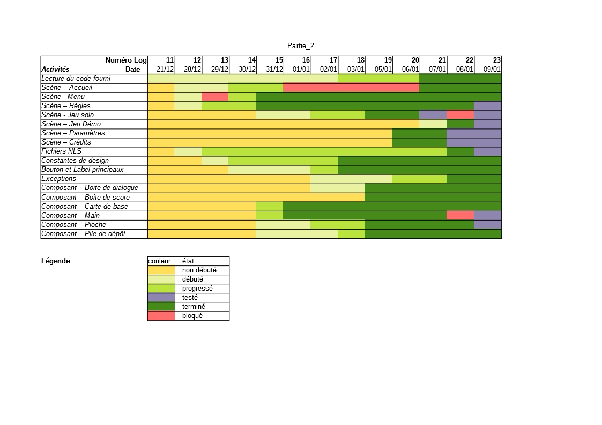

# ACDC-TheGame

Un arbitre, une IA et une IHM pour *The game*.

IMT - FIL1 - 2020

*JALLAIS Adrien : adrien.jallais@protonmail.com*

__*Partie 2 - Version 1.0*__

## Introduction

### Utilisation de l'application

Les fichiers sources sont accessibles dans le dossier suivant : [Code/FIL A1 ACDC Partie2 Jallais Adrien](../Code/FIL%20A1%20ACDC%20Partie2%20Jallais%20Adrien/src).
Pour savoir comment lancer l'application, reportez-vous au fichier suivant : [module-info.java](../Code/FIL%20A1%20ACDC%20Partie2%20Jallais%20Adrien/src/module-info.java).

### Auteurs

La dimension *frontend* ou Interface Homme Machine (IHM) a été réalisée par Adrien Jallais. Cette IHM utilise une API réalisée par Nicolas Kirchhoffer, à laquelle il a été apporté quelques modifications par Adrien Jallais. 

## Résultats

### Aperçu

L'*Illustration 1-1* présente ce que la fenêtre cliente affiche au cours d'une partie en **mode Solo**.

*__Illustration 1-1 :__ Capture de la fenêtre au cours d'une partie en mode Solo.*

L'*Illustration 1-2* présente ce que la fenêtre cliente affiche au départ d'une partie en **mode Démonstration**.

*__Illustration 1-2 :__ Capture de la fenêtre au départ d'une partie en mode Démonstration.*

### Progression et suivi du projet

Un fichier décrivant les logs réalisés quotidiennement est disponible dans le fichier suivant : [log.Jallais.Adrien.json](../log.Jallais.Adrien.json). En complément, le *Tableau 1* illustre ces logs pour mieux visualiser la cinétique de développement du projet.

*__Tableau 1 :__ Grille de progression du développement de l'application. Les logs représentent un jour de travail.*

Avec le *Tableau 1*, on observe que les premières  scènes qui ont été mises en place sont celles qui demandaient le moins de complexité. En effet, dans le but de monter en compétence de manière graduelle avec la librairie JavaFX les scènes d'accueil et du menu ont d'abord été réalisées car elles comportaient une infrastructure simple : un à deux composants d'agencement impliqués, et des composants interactifs basiques (bouton) avec des actions similaires (changement de scène).
La réalisation de ces scènes a permis également de poser les bases pour la mise en place d'un design homogène entre les différentes scènes de l'application. En effet il a été mis en évidence la nécessité d'un *wrapper* commun aux scènes pour plus définir une structure commune, ainsi que la mise en place de constantes communes, notamment pour les couleurs utilisées et l'espacement entre les composants d'une scène, comme c'est le cas pour les boutons et les labels. 

### Diagramme de classe

L' *Illustration 2* est un diagramme de classe UML généré avec [ObjectAid UML Explorer](https://objectaid.com/home). Les relations entre ses entités étant ajoutées de manière automatique, il est rapidement devenu surchargé et illisible.
Afin d'améliorer sa lisibilité, les caractéristiques suivantes ne sont pas montrées :

+ les relations de dépendance entre les classes (au profit de celles entre les packages),
+ les méthodes de visibilité publique des classes implémentant des interfaces (afin d'éviter une répétition entre ces deux entités),
+ les méthodes des classes du package [view.scene](../Code/FIL%20A1%20ACDC%20Partie2%20Jallais%20Adrien/src/view),
+ les classes du package [api](../Code/FIL%20A1%20ACDC%20Partie2%20Jallais%20Adrien/src/api).

*__Illustration 2 :__  Diagramme UML de classe de l'application.*

Les composants spécifique aux scènes de jeu sont rassemblés au sein du package [view.component](../Code/FIL%20A1%20ACDC%20Partie2%20Jallais%20Adrien/src/view/component), afin d'optimiser leur réutilisation au sein des scènes de type *APlayScene*. 
Les attributs des classes concrètes, de types *ACardComponent* de ce package, sont affichés dans le but de soulever le lien entre ces classes et le l'API. On voit notamment que les classes *CardComponent* et *LayComponent* possèdent un attribut de type *Carte* ou de type *int* respectivement, qui permettent de savoir à quel élément du jeu ils font référence.
De plus, un des attributs de *HandComponent* est de type *List*, dont chacun des éléments possèdent notamment un *CardComponent*, et donc par extension un attribut de type *Carte*.
En opposition, *DrawComponent* ne possède pas d'attribut de jeu mais il est initialisé avec une une variable de type *ICardView* qui permet de régir son style.

D'autres composants ne sont pas spécifiques aux scènes de jeu : [view.button](../Code/FIL%20A1%20ACDC%20Partie2%20Jallais%20Adrien/src/view/button), [view.label](../Code/FIL%20A1%20ACDC%20Partie2%20Jallais%20Adrien/src/view/label). Comme ces derniers n'ont ni la même finalité et ni la même tendance à être modifié, ils n'ont pas été rassemblés dans le même package. 

L'ensemble des scènes sont réunis au sein d'un même package : [view.scene](../Code/FIL%20A1%20ACDC%20Partie2%20Jallais%20Adrien/src/view/scene). 
On remarque qu'ils sont tous de type *AMainScene*, qui est un *BorderPane*, permettant ainsi de définir un masque de scène, utilisé notamment pour l'ajout d'une signature en bas de fenêtre. 
Les scènes de jeu (c'est-à-dire de type *APlayScene*), possèdent deux attributs : un de type *Jeu* et un de type *Joueur*, afin de permettre une interaction avec l'API. L'attribut *Joueur* est déterminé par les scènes concrètes l'implémentant (*IAScene* ou *HumanScene*), et l'attribut *Jeu* est également défini par le chemin du fichier constituant la pioche.
La classe *APlayScene* sollicite l'attribut *Jeu* en utilisant ses méthodes afin de piocher, obtenir les cartes de la main du joueur actuel, connaître l'état du plateau et de son achèvement (victoire ou défaite). 

Le réglage graphique des packages abordés ci dessus, est défini à partir de constantes énumérées au sein du package : [view.constant](../Code/FIL%20A1%20ACDC%20Partie2%20Jallais%20Adrien/src/view/constant).  On y trouve notamment la police, les couleurs des composants de notre application.

Le package [view.exception](../Code/FIL%20A1%20ACDC%20Partie2%20Jallais%20Adrien/src/view/exception), rassemble les exceptions nécessaires au traitement de celles soulevées par l'API, pouvant survenir lors de la création d'une pile ou de l'action d'un tour. Il permet notamment de régler les messages associés, en fonction de la langue choisie par l'utilisateur.

En effet, deux dimensions linguistiques sont prises en charge par cette application. Le package [nls](../Code/FIL%20A1%20ACDC%20Partie2%20Jallais%20Adrien/src/nls) (correspondant à l'abréviation : National Langage Support ou Soutien aux Langues Nationales) rassemble les éléments qui définissent le contenu des messages affichés à l'interface, afin de faciliter leur modification et leur traduction.

## Discussions 

### Analyse du code fourni

#### Modifications apportées

On peut retrouver les commit associés aux modifications de l'API en recherchant les mots clé suivant : *feat(gameAPI)* ou *fix(gameAPI)*, correspondant respectivement à l'ajout d'une nouvelle fonctionnalité ou la résolution d'un bug.

 Il a été rajoutées des méthodes, qui permettent les fonctionnalités suivantes : 

+ savoir si une partie est gagnée ou non avec *isVictoire* : en effet, je choisis d'affirmer que c'est à l'API et son arbitre de dire si la victoire est remportée ou non, et pas seulement d'afficher le score ([lien](https://github.com/Naedri/ACDC-TheGame/commit/1911f954874f06e2133082df0a616c8f70f920bc)) ;
+ savoir le nombre maximum de cartes autorisé par joueur *getNbCartesMax* : en effet, pour initialiser une nouvelle main après avoir pioché et qu'il n'y a plus assez de cartes dans la pioche pour atteindre le nombre maximum de carte autorisé et l'IHM doit afficher cette information, je choisis d'affirmer que c'est à l'API et son arbitre de donner cette indication et ai pu utiliser du code existant pour écrire cette méthode ([lien](https://github.com/Naedri/ACDC-TheGame/commit/3fcf4d25183a61cfe2854f87bc21cee83354cab3)) ;
+ vérifier la validité de la pioche fourni au format .txt : en effet la méthode *fromFile* ne vérifiant pas la présence de doublons, le nombre de cartes produites ([lien](https://github.com/Naedri/ACDC-TheGame/commit/8b7196650bd3a7d4f4ee18147a3678c4870f7ace)) ;
+ générer une pioche non pas seulement à partir d'un fichier, mais également de manière aléatoire :  afin de limiter mon impact sur l'API, je n'ai pas créé de nouvelle méthode mais seulement ajouté un cas à *fromFile*, qui renvoie une pioche générée aléatoirement lorsque le chemin indiqué est nul ([lien](https://github.com/Naedri/ACDC-TheGame/commit/7d01870799193e18c9c1894eae8063d0760edb7b)).

Il a été apporté des modifications au code de l'API, afin de permettre la résolution des bugs suivants : 

+ la méthode *passerTour*, ne permettaient pas d'incrémenter le nombre de tour si il n'y avait qu'un seul joueur ([lien](https://github.com/Naedri/ACDC-TheGame/commit/1fc4adc10db499756d3d4aecfcfa0e287ca280c7)) ;
+ dès lors que l'incrémentation des tours était de nouveau fonctionnel, la méthode *jouer* levait l'exception : *"Ce n'est pas votre tour !"* ([lien](https://github.com/Naedri/ACDC-TheGame/commit/799a215e24a23e89c74b32d9573ceea22757d749)) ;
+ la méthode *isPartieFinie*, ne prenait pas en compte que le joueur actuel est autorisé à passer son tour et donc à piocher, si il a posé un nombre de cartes suffisant ([lien](https://github.com/Naedri/ACDC-TheGame/commit/799a215e24a23e89c74b32d9573ceea22757d749)) ;
+ les piles de dépôt étaient initiées, non pas à 1, mais à 0 ([lien](https://github.com/Naedri/ACDC-TheGame/commit/10c0920570a1d475d7e5047db862c4a9adb064b5)) ;
+ lors de la fin d'un tour, le jeu était amener à piocher dans tous les cas, malgré que la pioche était vide ([lien](https://github.com/Naedri/ACDC-TheGame/commit/6da45776d36bfa877b504f8ff8473c6b4cc3f7e5)). 

#### Point négatifs du code fourni

carteIA constructeur avec indice de tas et pas un ITas

Liste de carte et non une pile -> desavantages de ne pas avoir les methodes associées, par exemple dans la méthode piocher : this.cartes.subList + removeAll alors qu'un pop aurait suffit

/!\ : 
	public List<Carte> getCartes() {
		return this.cartes;
	}
permet d'avoir la refererence de la liste de la carte est on peut l'annuler

a voir comment la victoire est atteinte

#### Choix de la pioche

Pas de factory de pioche, peut on mettre n'importe quel type de text ?
A voir si on peut mettre des nombres en double.

#### Méthode jouer

`public void jouer(int tasId, Carte carte, Joueur joueur)`
arguments non homogènes -> plus facile si on avait juste une valeur de carte à mettre

#### Organisation du code

pas de séparation en package
deux fonctions Main -> un seul devrait être appellé un 

#### Piles de dépôts initiées à 0 et non 1

#### Partie terminée mais pas de victoire ou de défaite

On obtient seulement le score et pas la victoire ou non.

#### Factory Pioche

#### Service IA

On ne peut obtenir le meilleur coup qu'il faut jouer sans qu'il le soit : pas d'indice possible car il est joué directement.

#### Le main ne fonctionne pas 

Comme l'indique la photo ci dessous la fonction main de l'API,  ne pouvait s'executer.

#### Points positifs  du code fourni

carteIA permettant d'associer un poids à une carte de manière durable

Liste de tas

Joueur IA extends JouerHumain

levée d'exceptions utiles pour l'affichage d'erreur

### Choix réalisés

Une partie des choix qui ont été réalisé au cours du développement de cette IHM ont été expliqué dans la partie de ce rapport traitant des modifications apportées à l'API.
Par ailleurs, bien que l'API permette de jouer à plusieurs joueurs, il a été choisi de se focaliser sur le but premier du cahier des charges, étant de fonctionner avec un seul joueur, afin de respecter les délais de livraison de l'application.

### Bilan de l'application

#### Points faibles de l'application

Non compatible avec les smartphones

Pas de fonctionnalité drag and drop pour les cartes qui semblent être une fonctionnalité importante pour l'utilisateur

La classe *APlayScene* propose un mode de fonctionnement plus chargé qu'il ne pourrait l'être. En effet, la classe IAScenepar rapport à celle qu'elle des méthodes qui ne sont pas utilisé refactoring des classes *HumanScene* et *IAScene* n'a pas été réalisé plus de rapidité de dévelRassemble les méthodes a

#### Points forts de l'application

Respect du cahier des charges, 

changement de langue possible,

IHM basée sur l'utilisation de composants réutilisable,

En abordant plusieurs montée en compétences du développeur car elle a permis d'aborder plusieurs sujet

Les composants ont un design homogène entre eux car celui est basé sur des énumérations.

Pas d'utilisation de feuille css, ainsi l'utilisation de variables est possible pour l'affinement du style

